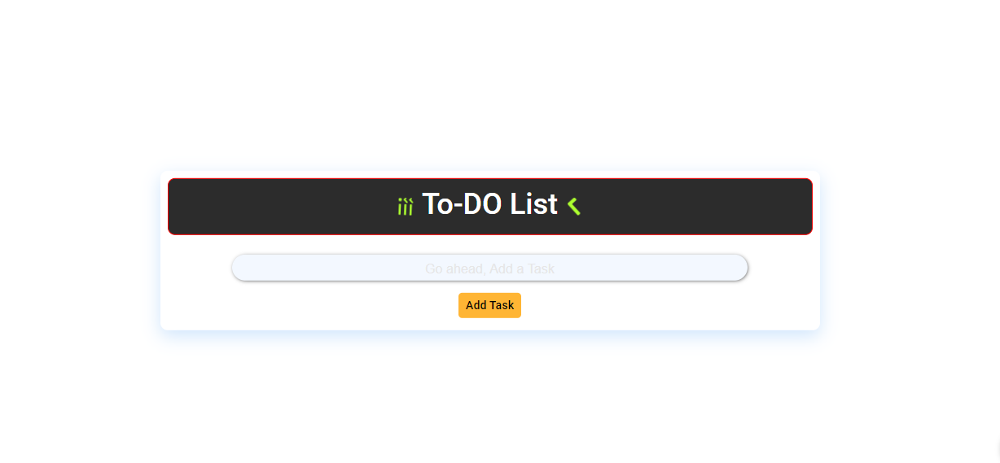
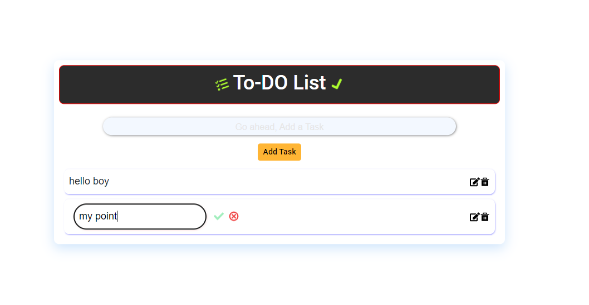

# React To Do App
This React-based to-do app offers a streamlined way to manage your tasks. It provides essential features for creating, editing, and deleting to-do items, ensuring you stay organized and focused.

~ Add todo
~ Delete todo
~ Edit todo

# home page

# edit the task

#  How to Use:
Enter a new task in the provided box and press Enter.
Remove a task by clicking the delete symbol.
Modify a task by double-clicking on its text.
Complete or uncomplete a task by checking or unchecking the box.

# How to Run:
Copy this project to your computer.
Install necessary files by running "npm install".
Start the app by running "npm start".
View the app in your web browser at http://localhost:5173/.

